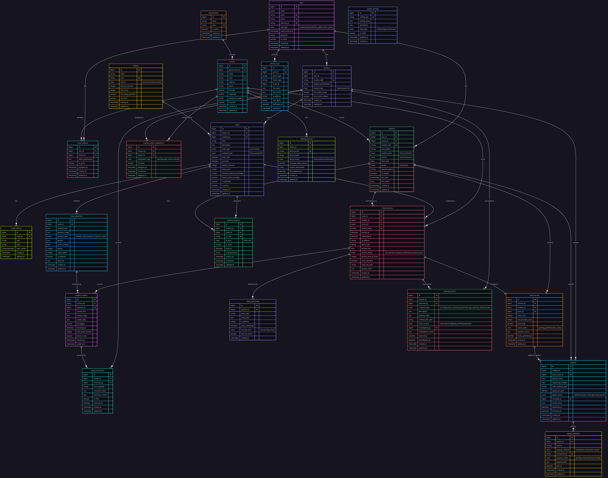
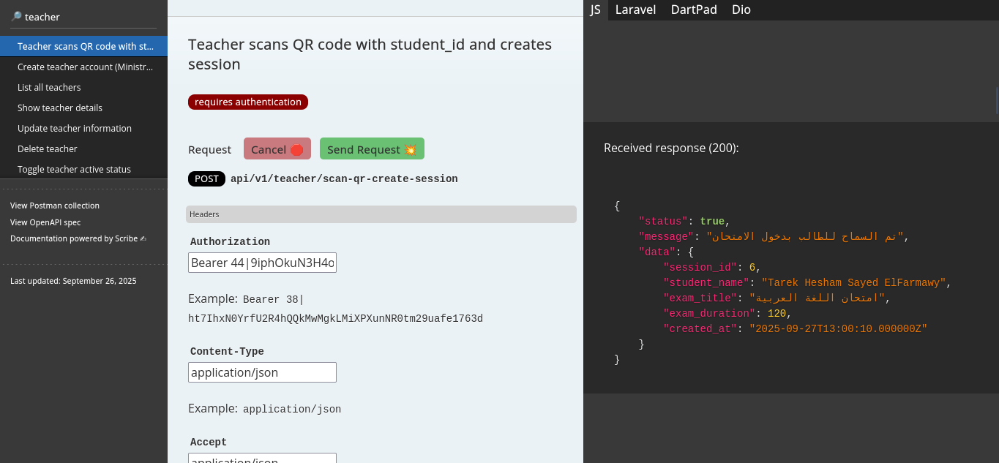

<p align="center"><a href="https://laravel.com" target="_blank"></a></p>

# Exam Management System API

An exam management system built with **Laravel 12**, using **Sanctum** for authentication and **Scribe** for API documentation.  
The project is designed with modular architecture, supporting versioned APIs to serve both web applications and mobile clients.

[Live Demo !!](https://exam-api.koyeb.app/)

---

## Features

-   User management (students, teachers, school admins, ministry admins).
-   Schools and administrators management.
-   Subjects and exams management (practice/final).
-   Exam sections and multiple question types:
    -   Multiple Choice
    -   True/False
    -   Essay
    -   Fill in the blanks
-   Exam sessions with monitoring and anti-cheating features.
-   Student answers and essay corrections.
-   Results publishing and appeals management.
-   Appeal payments with multiple payment methods.
-   System settings and activity logging.
-   Auto-generated API documentation with **Scribe**.

---

## Tech Stack

-   **Backend**: Laravel 12 (PHP 8.4+)
-   **Authentication**: Laravel Sanctum
-   **API Documentation**: Scribe
-   **Database**: MySQL
-   **Architecture**:
    -   Contracts & DTOs
    -   Repositories & Services (with interfaces)
    -   Events
    -   Modular structure (each feature as a separate module)
-   **Versioned APIs** (v1, v2, ...) Supported

---

## Project Structure

```

app/
├── Console/
│   └── Commands/         # Custom Artisan commands
│
├── Core/
│   ├── Contracts/        # Interfaces
│   ├── DTOs/             # Data Transfer Objects
│   ├── Models/           # Core Models
│   ├── Repositories/     # Data access layer
│   ├── Services/         # Business logic
│   └── Exceptions/       # Custom exceptions
│
├── Http/
│   ├── Controllers/      # API controllers
│   ├── Middleware/       # Middlewares
│   ├── Requests/         # Form request validation
│   └── Resources/        # API Resources
│
├── Jobs/                 # Queue jobs
│
├── Modules/              # Feature-based modules
│   ├── Appeals/
│   ├── Authentication/
│   ├── ExamManagement/
│   ├── Monitoring/
│   ├── Results/
│   └── UserManagement/
│
└── Providers/            # Service providers

```

---

## ERD

The database schema covers users, schools, exams, students, results, appeals, monitoring, payments, and system logs.

### Entity Relationship Diagram



---

## Installation

```bash
# Clone repository
git clone https://github.com/TarekHesham/exam-system.git

cd exam-system

# Install dependencies
composer install

# Copy environment file
cp .env.example .env

# Generate app key
php artisan key:generate

# Run migrations and seeders
php artisan migrate --seed

# Start local server
php artisan serve
```

---

## Authentication

The system uses **Laravel Sanctum** for authentication.
Each request must include a valid Bearer Token in the header:

```http
Authorization: Bearer <token>
```

---

## API Documentation

API documentation is generated automatically using **Scribe**.
After running the project, you can access it at:

```
/docs
```



---

## Versioning

The project is structured to support API versioning.
Each version (v1, v2, etc.) can evolve independently without breaking existing clients.

---

## Contribution

1. Fork the repository
2. Create a new feature branch (`git checkout -b feature/new-feature`)
3. Commit changes (`git commit -m "Add new feature"`)
4. Push to branch (`git push origin feature/new-feature`)
5. Create a pull request

---

## License

This project is licensed under the MIT License.
